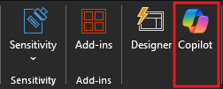

# Identify key information and summarize with Copilot in PowerPoint

Microsoft 365 Copilot in PowerPoint is an AI-powered feature that can help you create, design, and format your slides.  You can type in what you intend to convey with your presentation, and Copilot helps you get it done.

Copilot can help you move past that initial blank slide and get you moving in the right direction. To start using Copilot in PowerPoint, you can open the **Copilot** pane by selecting the Copilot icon in the ribbon's **Home** tab.

From the Copilot pane, you can ask to have the presentation summarized or ask questions about the content on the slides. In the following example, we start with a basic request to summarize the presentation and add other elements to make the prompt more robust.

## Let's get crafting

First, download **_[Mystic Spice Premium Chai Market Analysis Presentation.pptx](https://go.microsoft.com/fwlink/?linkid=2268768)_** and save the file to your **OneDrive folder** if you haven't yet done so.

> [!NOTE]
> Starting prompt:
>
> _Summarize this PowerPoint presentation._

In this simple prompt, you start with the basic **Goal**: _to summarize a PowerPoint._ However, there's no information about why the presentation needs to be summarized or what the summary is needed for.

| Element | Example |
| :------ | :------- |
| **Basic prompt:** Start with a **Goal** | **Summarize this PowerPoint presentation.** |
| **Good prompt:** Add **Context** | Adding **Context** can help Copilot understand the purpose of the summary and tailor the response accordingly. _"...for my boss that includes an overview of the main points before meeting with their client."_ |
| **Better prompt:** Specify **Source(s)** | Adding **Sources** can help Copilot understand which presentation or part needs to be summarized and provide a more accurate response. _"...slides 5-10 in this PowerPoint presentation..."_ |
| **Best prompt:** Set clear **Expectations** | Lastly, adding **Expectations** can help Copilot understand how to format the summary and what level of detail is required. _"Please format the main points as a bulleted list and use a professional tone."_ |

> [!NOTE]
> **Crafted prompt**:
>
> _Summarize slides 5-10 in this PowerPoint presentation for my boss that includes an overview of the main points before meeting with their client. Please format the main points as a bulleted list and use a professional tone._

In this prompt, the **Goal**, **Context**, **Source**, and **Expectations** are all provided, giving Copilot enough direction to generate a response that meets your needs.

## Explore more

Try out the final prompt we crafted, but using your own PowerPoint presentation. Customize the **Context**, **Sources**, and **Expectations** so that you get what you need from the presentation, without any extra stuff you don't.

> [!IMPORTANT]
> This feature is available to customers with a Microsoft 365 Copilot license or Copilot Pro license. For more information, see [Welcome to Copilot in PowerPoint](https://support.microsoft.com/office/welcome-to-copilot-in-powerpoint-57133c75-24c0-4519-8096-d0dadf25fb8d).
