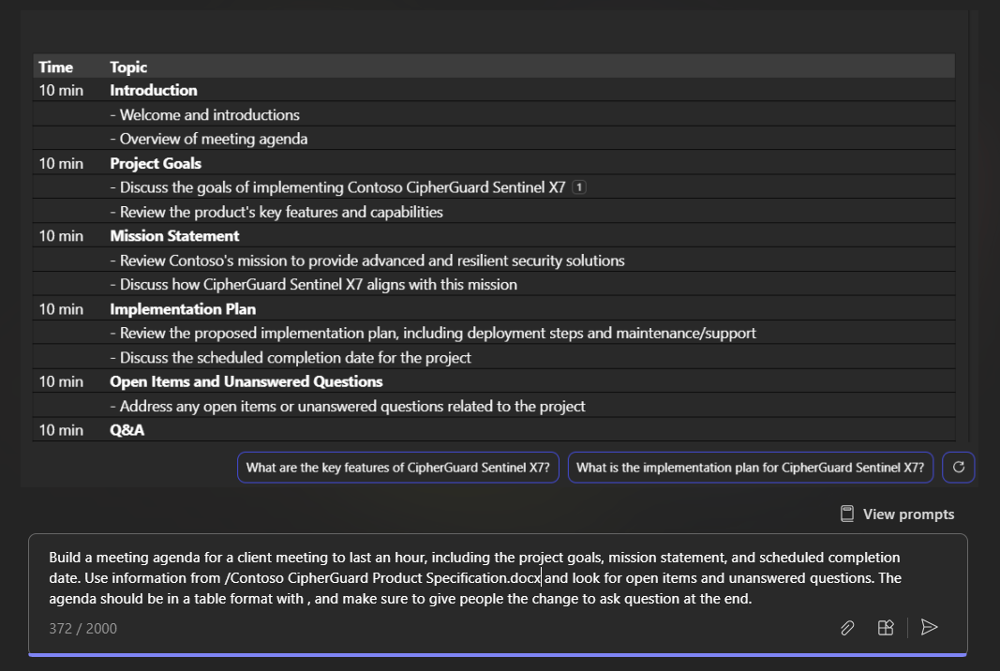

# Brainstorm new ideas, lists, and reports with Microsoft 365 Copilot Chat

Microsoft 365 Copilot Chat (Copilot Chat) combines the power of artificial intelligence (AI) with your work data and apps to help you unleash creativity, unlock productivity, and uplevel skills. It works across multiple apps and content, giving you the power of AI together with your secure work data. Its ability to synthesize information and create things from multiple sources at once empowers you to tackle broader goals and objectives.

To compare, Copilot in the different Microsoft 365 apps (such as Word or PowerPoint) is specifically orchestrated to help you **within that one app**. For example, Copilot in Word is designed to help you better draft, edit, and consume content. In PowerPoint, it’s there to help you create better presentations. But with Copilot Chat, we can pull that all together into a new experience.

You can access Copilot Chat in several ways:

- Use Copilot in desktop and mobile versions of Microsoft Teams. See [Use Copilot Chat in Teams](https://support.microsoft.com/topic/open-microsoft-365-chat-in-teams-c6de0a62-4f9e-479d-b5f2-af036e342181).

- Access Copilot Chat at Microsoft.com/Copilot. See [Use Copilot Chat at Microsoft365.com/copilot](https://support.microsoft.com/topic/use-microsoft-365-chat-at-microsoft365-com-or-in-the-microsoft-365-office-app-4a2538f9-962f-4c7c-a368-f6006bc13d6f).

## Let's get crafting

Using **Contoso CipherGuard Product Specification.docx** from a previous unit, open Copilot Chat in Teams to work on the next prompt.

> [!NOTE]
> Starting prompt:
>
> _Build a meeting agenda._

In this simple prompt, you start with the basic **Goal**: _to build out a meeting agenda_. However, there's no information about the purpose or goal of the meeting.

| Element | Example |
| :------ | :------- |
| **Basic prompt:** Start with a **Goal** | **_Build a meeting agenda._** |
| **Good prompt:** Add **Context** | Adding **Context** can help Copilot understand why you are calling the meeting and what you want to discuss. _"...for a client meeting to last an hour, including the project goals, mission statement, and scheduled completion date."_ |
| **Better prompt:** Specify **Source(s)** | Adding **Sources** can help Copilot know where to look for specific information. _"Use information from **/Contoso CipherGuard Product Specification.docx** and look for open items and unanswered questions."_ |
| **Best prompt:** Set clear **Expectations** | Lastly, adding **Expectations** can help Copilot understand how you want the document to be written and formatted. _"The agenda should be in a table format with time allotments, and make sure to give people the chance to ask questions at the end."_ |

> [!NOTE]
> **Crafted prompt**:
>
> _Build a meeting agenda for a client meeting to last an hour, including the project goals, mission statement, and scheduled completion date. Use information from **/Contoso CipherGuard Product Specification.docx** and look for open items and unanswered questions. The agenda should be in a table format with time allotments, and make sure to give people the chance to ask questions at the end._

Review the agenda and make any adjustments or refinements, then add it to your meeting invite in Teams.

### Referencing sources

As in the example, if you want Copilot to base your new presentation off a file, meeting, or person (even all three), you can tell it to do that. In the prompt window, just start typing a forward slash "/" and a popout window will offer you recent meetings, files, or people to reference.

> [!IMPORTANT]
> You must have permission to access the files you're referencing, whether they're located in your organization's SharePoint or OneDrive and can be either Word, Excel, or PowerPoint files.

## Explore more

Here are some suggestions for prompts you might want to try. Copy them or modify them to suit your needs.

- What happened in my last meeting?

- Catch up on unread chats.

- Draft a message that OKRs are due next week.

- Tell my team how we updated the product strategy.

- Summarize the chats, emails, and documents about [a customer] escalation that happened last night.

- What is the next milestone on [a project]? Are there any risks? Help me brainstorm a list of some potential ways to mitigate.

- Write a planning overview in the style of [a file] that contains the timeline from [a different file] and incorporates the project list in the email from [a person].
