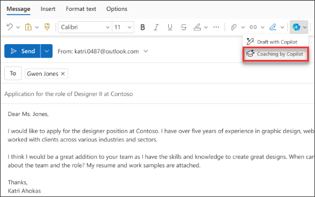

# Rewrite messages and replies for tone using Microsoft 365 Copilot in Outlook

Have an important email to write and want to feel confident that it effectively conveys your intended message? With Copilot in Outlook, you can get helpful suggestions on how to adjust the tone, clarity, and reader sentiment before you hit send.

1. In Outlook, select **Home > New Mail > Mail**. Type your email message.

1. Select the **Copilot** icon from the toolbar. Choose **Coaching by Copilot** from the drop-down menu.

    

1. Copilot reviews your email and offer suggestions on improving the tone, clarity, and reader sentiment.

1. If you like any or all of the suggestions, incorporate the feedback into the draft. When you're satisfied, send your email.

    

In the following example, we start with a simple prompt and add elements along the way. Follow along with the example after using Copilot to draft an email.

## Let's get crafting

**First, ask Copilot in Outlook to draft a fictitious email** with the following prompt:  

> _Draft a short product update announcement for customers about our latest software release. Highlight key new features, improvements, and how they benefit users._  

> [!NOTE]
> Starting prompt:
>
> _Review this email and make suggestions to improve it._

In this simple prompt, you start with the basic **Goal**: _to improve the email_. However, there isn't much detail about what kind of improvements are needed.  

| Element | Example |
| :------ | :------- |
| **Basic prompt:** Start with a **Goal** | **_Make this email more formal._** |
| **Good prompt:** Add **Context** | Adding **Context** helps Copilot understand the purpose of the email and what kind of improvements are needed. _"...so it sounds more professional and polished while maintaining a warm and engaging tone."_ |
| **Better prompt:** Specify **Source(s)** | The **Source** for this prompt is the email you've already drafted in Outlook. _"...this email."_ |
| **Best prompt:** Set clear **Expectations** | Adding **Expectations** helps Copilot understand the desired changes. _"Ensure the email is professional, concise, and highlights the key details of the product update clearly."_ |

> [!NOTE]  
> **Crafted prompt:**  
>
> _Make this email more formal. Ensure the email is professional, concise, and highlights the key details of the product update clearly._  

This prompt gives Copilot everything it needs to come up with a good answer, including the **Goal**, **Context**, **Source**, and **Expectations**.
